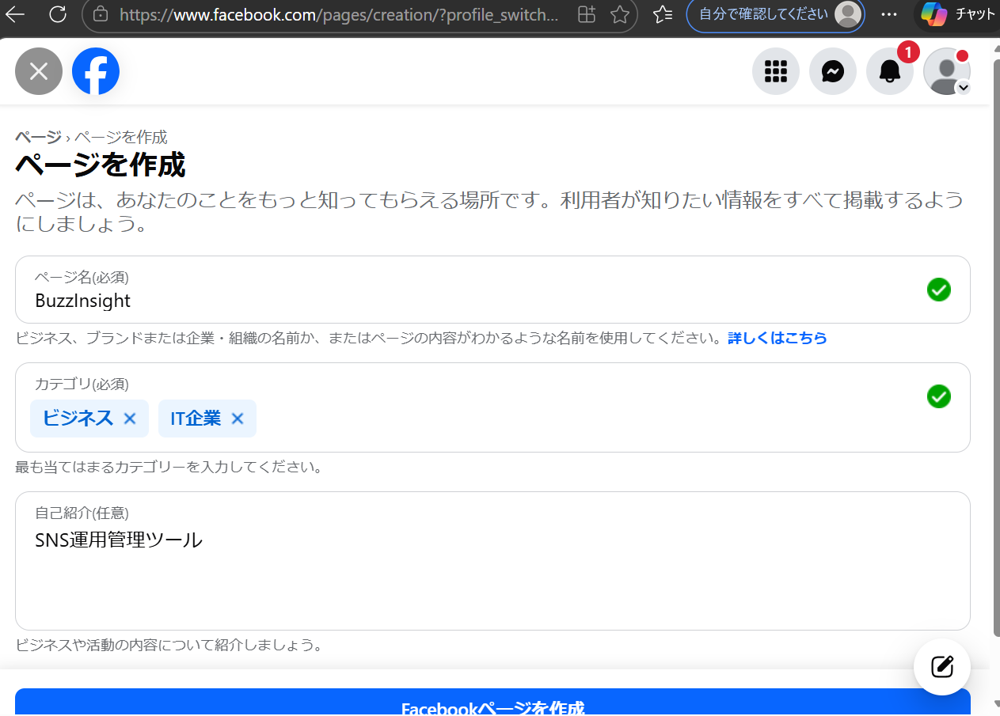

# 新しいMeta App作成ガイド

## 前提条件

1. ✅ 新しいFacebookアカウント（あなたのスマホで二段階認証設定済み）
2. ✅ Facebookビジネスページ（新規作成または既存）
3. ✅ Instagramビジネスアカウント（Facebookページにリンク）

---

## ステップ1: Facebookアカウントの準備

### 1-1. Facebookアカウント作成（まだない場合）

1. [Facebook](https://www.facebook.com/)にアクセス
2. 新規アカウントを作成
3. あなたのスマホで二段階認証を設定

### 1-2. Facebookビジネスページ作成

1. Facebookにログイン
2. 左サイドバーの「ページ」をクリック
3. 「新しいページを作成」をクリック
4. ページ情報を入力:
   - ページ名: `BuzzInsight`（または任意の名前）
   - カテゴリ: `ビジネス・経済`
   - 説明: `SNS運用管理ツール`
5. 「ページを作成」をクリック

### 1-3. Instagramビジネスアカウントをリンク

1. Facebookページの設定を開く
2. 左サイドバーの「Instagram」をクリック
3. 「アカウントをリンク」をクリック
4. Instagramにログイン
5. ビジネスアカウントに切り替え（まだの場合）
6. リンクを承認

---

## ステップ2: Meta for Developersアカウント作成

### 2-1. 開発者アカウント登録

1. [Meta for Developers](https://developers.facebook.com/)にアクセス
2. 右上の「スタート」または「ログイン」をクリック
3. Facebookアカウントでログイン
4. 開発者登録を完了:
   - 電話番号認証
   - 利用規約に同意

---

## ステップ3: 新しいアプリを作成

### 3-1. アプリ作成

1. [Meta for Developers](https://developers.facebook.com/)にログイン
2. 右上の「マイアプリ」をクリック
3. 「アプリを作成」ボタンをクリック

### 3-2. アプリタイプ選択

- **「ビジネス」**を選択
- 「次へ」をクリック

### 3-3. アプリ情報入力

- **アプリ表示名**: `BuzzInsight`（または任意の名前）
- **アプリの連絡先メールアドレス**: あなたのメールアドレス
- **ビジネスアカウント**: 「新しいビジネスアカウントを作成」を選択
  - ビジネス名: `BuzzInsight`
  - あなたの名前を入力
- 「アプリを作成」をクリック

### 3-4. セキュリティチェック

- 表示されるセキュリティチェックを完了

---

## ステップ4: Instagram製品を追加

### 4-1. Instagram Basic Display API追加

1. ダッシュボードで「製品を追加」セクションを探す
2. 「Instagram」を見つける
3. 「設定」ボタンをクリック

### 4-2. 権限の設定

以下の権限を有効化:
- ✅ `instagram_business_basic`
- ✅ `instagram_manage_insights`
- ✅ `instagram_business_manage_messages`
- ✅ `instagram_manage_comments`

---

## ステップ5: アプリIDとシークレットを取得

### 5-1. 基本設定を開く

1. 左サイドバーの「設定」→「ベーシック」をクリック

### 5-2. 情報をコピー

以下の情報をメモ帳にコピー:

```
アプリID: [ここに表示される数字]
app secret: [「表示」をクリックして表示される文字列]
```

---

## ステップ6: OAuthリダイレクトURIを設定

### 6-1. 基本設定で追加

1. 「設定」→「ベーシック」ページで下にスクロール
2. 「+ プラットフォームを追加」をクリック
3. 「ウェブサイト」を選択
4. サイトURL: `http://localhost:3000`

### 6-2. 有効なOAuthリダイレクトURIを追加

1. さらに下にスクロール
2. 「有効なOAuthリダイレクトURI」フィールドを探す
3. 以下を追加:
   ```
   http://localhost:3000/auth/meta/callback
   ```
4. 「変更を保存」をクリック

---

## ステップ7: ビジネス統合を作成（Config ID取得）

### 7-1. ビジネス統合ページに移動

1. 左サイドバーの「製品」→「Instagram」→「ビジネス統合」をクリック
2. または「アプリの設定」→「ビジネス統合」

### 7-2. 統合を作成

1. 「ビジネス統合を作成」ボタンをクリック
2. 設定を完了
3. 作成された統合の**Config ID**をコピー

```
Config ID: [ここに表示される数字]
```

---

## ステップ8: アプリモードを確認

### 8-1. 開発モードに設定

1. 「設定」→「ベーシック」ページの上部
2. 「アプリモード」が**「開発モード」**になっていることを確認
3. 開発モードでは、あなたのアカウントと追加したテストユーザーのみが使用できます

### 8-2. テストユーザーを追加（必要に応じて）

1. 左サイドバーの「役割」をクリック
2. 「テストユーザー」タブ
3. 必要に応じてテストユーザーを追加

---

## ステップ9: 環境変数を更新

### 9-1. server/.envファイルを編集

`server/.env`ファイルを開いて、以下を更新:

```env
# Meta Business Login (Instagram API)
META_APP_ID=【ステップ5-2でコピーしたアプリID】
META_APP_SECRET=【ステップ5-2でコピーしたapp secret】
META_REDIRECT_URI=http://localhost:3000/auth/meta/callback
META_CONFIG_ID=【ステップ7-2でコピーしたConfig ID】
META_GRAPH_API_VERSION=v21.0
```

### 9-2. サーバーを再起動

```powershell
# サーバーを停止（Ctrl+C）
# 再起動
cd server
npm run dev
```

---

## ステップ10: 動作確認

### 10-1. Instagram接続テスト

1. ブラウザで `http://localhost:3000/settings` にアクセス
2. 「Instagram」の「接続する」ボタンをクリック
3. ポップアップウィンドウが開く
4. Facebookにログイン（新しいアカウント）
5. Instagramビジネスアカウントを選択
6. 権限を承認
7. 「接続完了」メッセージが表示される

### 10-2. データ確認

1. ダッシュボード (`/dashboard`) に移動
2. 実際のInstagramデータが表示されることを確認
3. 「モックデータ表示中」バッジが消えていることを確認

---

## トラブルシューティング

### エラー: "Invalid OAuth redirect URI"

**原因**: リダイレクトURIが正しく設定されていない

**解決方法**:
1. Meta for Developersの「設定」→「ベーシック」
2. 「有効なOAuthリダイレクトURI」に `http://localhost:3000/auth/meta/callback` が追加されているか確認
3. 変更を保存
4. サーバーを再起動

---

### エラー: "no_ig_linked_to_pages"

**原因**: InstagramアカウントがFacebookページにリンクされていない

**解決方法**:
1. Facebookページの設定を開く
2. 「Instagram」セクション
3. Instagramアカウントをリンク
4. 再度接続を試行

---

### エラー: "Invalid App ID"

**原因**: App IDが間違っている

**解決方法**:
1. Meta for Developersの「設定」→「ベーシック」でApp IDを確認
2. `server/.env`の`META_APP_ID`を更新
3. サーバーを再起動

---

### データが表示されない

**原因**: Instagramアカウントにデータが不足している

**確認事項**:
- Instagramビジネスアカウントであることを確認
- 過去14日間に投稿があることを確認
- フォロワーが一定数いることを確認（最低100人推奨）
- アカウントが最近作成された場合、データが蓄積されるまで待つ

---

## 本番環境への移行（将来）

開発が完了したら:

1. **アプリレビューを申請**
   - 必要な権限の承認を取得
   - Instagram Graph APIの使用許可

2. **アプリモードを変更**
   - 「開発モード」→「ライブモード」に変更

3. **本番環境のリダイレクトURIを追加**
   - 本番環境のドメインを追加

4. **環境変数を更新**
   - 本番環境用の設定に更新

---

## チェックリスト

作成完了後、以下を確認:

- [ ] Facebookアカウント作成（あなたのスマホで二段階認証）
- [ ] Facebookビジネスページ作成
- [ ] Instagramビジネスアカウントをページにリンク
- [ ] Meta for Developers開発者登録
- [ ] 新しいアプリ作成
- [ ] Instagram製品追加
- [ ] アプリIDとシークレット取得
- [ ] OAuthリダイレクトURI設定
- [ ] Config ID取得
- [ ] `server/.env`更新
- [ ] サーバー再起動
- [ ] Instagram接続テスト成功
- [ ] ダッシュボードで実データ表示確認

---

## 必要な情報まとめ

最終的に以下の情報が必要です:

```env
META_APP_ID=【新しいアプリID】
META_APP_SECRET=【新しいapp secret】
META_CONFIG_ID=【新しいConfig ID】
META_REDIRECT_URI=http://localhost:3000/auth/meta/callback
META_GRAPH_API_VERSION=v21.0
```

これらを`server/.env`に設定してサーバーを再起動すれば完了です。

---

## 参考リンク

- [Meta for Developers](https://developers.facebook.com/)
- [Instagram Graph API ドキュメント](https://developers.facebook.com/docs/instagram-api)
- [Meta Business Login](https://developers.facebook.com/docs/facebook-login/overview)
- [Facebookページ作成](https://www.facebook.com/pages/create)

---

何か問題があれば、エラーメッセージと一緒にお知らせください。
